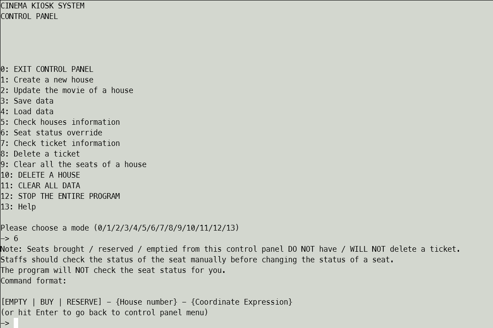

# Seat Operation for Administrator

Administrator can manually **override** the status of a seat.

This can be done by entering mode `6`(Buy / Reserve / Empty a seat) 
after login as **administrator**. 

## Warning ⚠️
<b>
Any changes of seat by this mode will NOT affect the ticket system.
It means that manually setting a seat to be Sold, ticket will NOT be generated.
And turning a seat from Sold to Reserved/Empty will not delete any tickets.
Administrator is RECOMMENDED to check the status of the seat before changing it.
This mode will NOT check it for you. You will not be stopped when changing 
the seat status to the same as before.
</b>

## HOWTO: Change the seat status

Login as **administrator**, enter mode `6`(Buy / Reserve / Empty a seat).
You should see something like this:

The format of doing seat(s) operation is:

`[EMPTY | BUY | RESERVE] - {House number} - {Coordinate Expression}`

Replace `[EMPTY | BUY | RESERVE]` to the action you want to perform 
(`Empty`, `BUY`, `RESERVE`?);

replace `{House number}` to the house number of the seat(s);

replace `{Coordinate Expression}` to the coordinate expression
representing the range of the seat(s) selected.

---

The command is case-insensitive. All spaces are ignored.

You MUST separate the three argument using hyphens (`-`),
as shown above.

You SHOULD NOT include brackets (`[]`, `{}`) and vertical bar (`|`).
They are for demonstration purpose only, though they will be ignored.

### Coordinate Expression
In control panel mode `6`(Buy / Reserve / Empty a seat),
you may use a coordinate expression to express one or more seats.

A coordinate expression can be:
1. A single seat coordinate (E.g. `1A`, `2B`, `P35`, `35P`,`99Z`), or
2. Two seat coordinates separated by a comma (`:`),
   representing the start and end of an area of seats (area may not be a rectangle).
   - These two coordinates MUST NOT be the same seat.
   - The two coordinates must be two COMPLETE coordinates.
   (i.e. no missing row / column number in the two coordinates)
   - The first seat (the first coordinate) MUST be in front of the last seat (the second coordinate). Order is counted by row, then column.
   - Valid examples: `1A:99Z`, `P35:P45`, `35P:45P`

   

---
<small>
The key words "MUST", "MUST NOT", "REQUIRED", "SHALL", "SHALL
NOT", "SHOULD", "SHOULD NOT", "RECOMMENDED", "NOT RECOMMENDED",
"MAY", and "OPTIONAL" in this document are to be interpreted as
described in 
<a href="https://www.rfc-editor.org/bcp/bcp14" target="_blank">BCP 14</a>
[<a href="https://www.rfc-editor.org/rfc/rfc2119" target="_blank">RFC2119</a>]
[<a href="https://www.rfc-editor.org/rfc/rfc8174" target="_blank">RFC8174</a>]
when, and only when, they
appear in all capitals, as shown here.
</small>

---

Copyright © 2023 Joe Chau, Licensed under the 
<a href="https://www.apache.org/licenses/LICENSE-2.0" target="_blank">Apache License, Version 2.0</a>.