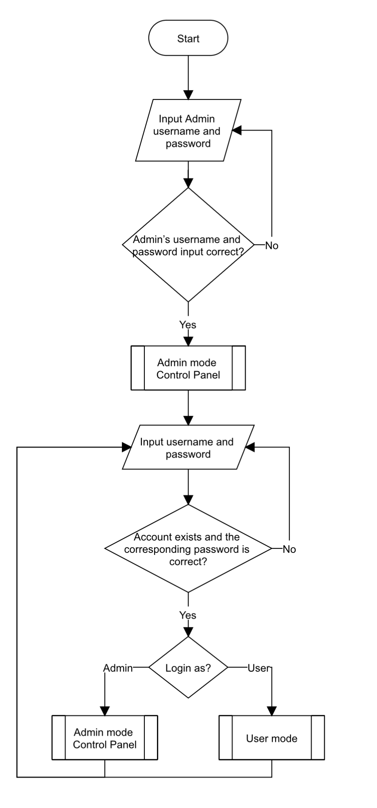

<!-- README
This markdown file is designed to be read online only.
Visit https://joeccp.github.io/SBA/REPORT.html 
-->


<!-- https://mermaid.js.org/config/usage.html#using-mermaid -->
<script type="module">
  import mermaid from 'https://cdn.jsdelivr.net/npm/mermaid@10/dist/mermaid.esm.min.mjs';
</script>


# SBA Report -- by Joe Chau

## Design

Some tools are used for the software engineering of this project.

### Waterfall Model

Waterfall Model is used when developing this project.

<pre class="mermaid">
flowchart LR
    Requirements -->
    Design -->
    Implementation -->
    Testing -->
    dpm[Deployment] -->
    mtn[Maintenance] --> dpm
</pre>

`Requirements`: I studied and analysis the requirements carefully, 
to ensure I have fulfilled and will implement all the required features.

`Design`: In the very beginning, I choose to use the 'menu and mode' design for the user interface 
(which is, providing different menus for administrator and user respectively,
and each menu has different modes).
I decided to encapsulate all the scripts into one single Python package, the basic structure
of the program was designed:
```text
# The structure of my very early prototype of this program

__init__.py
__main__.py
├── admin.py
├── colour.py
├── House.py
├── user.py
├── common.py
├── accounts.toml
```
I hence had a basic concept of the modularity of this program.

`Implementation`: See [Implementation](#implementation)

`Testing`: This program was tested so many times. I simulated all different kinds of 
scenarios, and possible inputs of the users.

`Deployment`: (Skipped as this is just a simulation of the kiosk system)

`Maintenance`: There are bug fixes and updates regularly.


### Flowchart
Here is a flowchart showing the basic structure of this program:



### Pseudocode

After further refinement and improvement, here is the pseudocode of the main program:

```text
The main program (function)

 1 | Initialize the log function
 2 | if the system is not Windows then
 3 |     exit the program
 4 | if the Python version is too old then
 5 |     exit the program
 6 | Clear the screen
 7 | Set the color of the terminal
 8 | Load saved data
 9 | while true do
10 |     input username
11 |     input password
12 |     if the username and password not correct AND it is the admin's account then
13 |         break the loop
14 | adminMode()
15 | while true do
16 |     input username
17 |     if the username exists then
18 |         input password
19 |         if the password is correct then
20 |             if the username is admin then
21 |                 adminMode()
22 |             else
23 |                 userMode()
```

## Implementation

### Features

Required features:
- [X] [Login system](docs/login.md)
- [X] [House and movie creation](docs/house.md)
- [X] [View seating plan](docs/house.md#howto-see-the-seating-plan-of-a-house)
- [X] [Seat selection](docs/ticket.md#howto-buy-a-seat-as-a-user)
- [X] [Status storage](docs/dataStorage.md)
- [X] [Calculation (of the total number of the tickets sold)](docs/ticket.md#howto-check-ticket-information)

Large additional features:
- [Ticket operation](docs/ticket.md)
- [Admin seat status override](docs/adminSeatOperation.md)
- Help function / [Documentation](README.md)


## Related files
- [Problem Analysis](Problem_Analysis.md)

---

By Joe Chau
